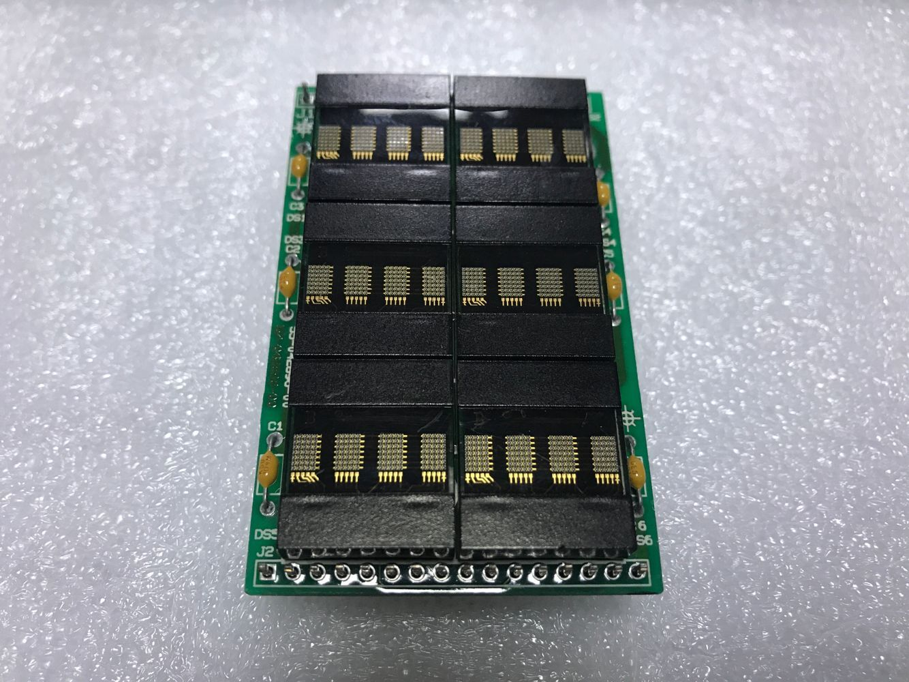
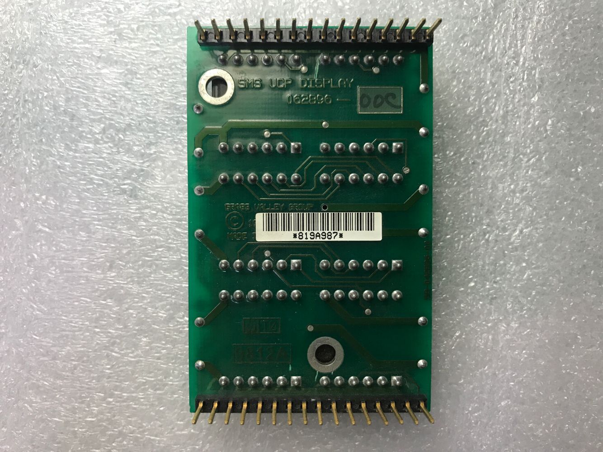

# DLR1414  

DLR1414 location distribution

| B0  | B1  |
| --- | --- |
| B2  | B3  |
| B4  | B5  |

Pin map  
32-17  
1-16  
| Pin   | Fuction | Pin    | Fuction |
|-------| ------- | -------| --------|
|1      |A1       |32      |GND      |
|2      |GND      |31      |D0       |
|3      |WR0      |30      |VCC      |
|4      |VCC      |29      |D1       |
|5      |WRB1     |28      |GND      |
|6      |GND      |27      |D2       |
|7      |WRB2     |26      |VCC      |
|8      |VCC      |25      |D3       |
|9      |WRB3     |24      |GND      |
|10     |GND      |23      |D4       |
|11     |WRB4     |22      |VCC      |
|12     |VCC      |21      |D5       |
|13     |WRB5     |20      |GND      |
|14     |GND      |19      |D6       |
|15     |VCC      |18      |VCC      |
|16     |VCC      |17      |A0       |

  

  

  

  
